# K3s High-Availability Cluster on AWS EC2

**Student Name: NT Thombela**
**Student Number: 230846181**


This guide walks you through deploying a **K3s HA cluster with 3 master (server) nodes** on AWS EC2 `t3.large` instances using embedded etcd. All examples are AWS-native — no external datastore or load balancer is required to bootstrap the cluster.

> For the full K3s documentation see <https://docs.k3s.io/>.

---

## Architecture

| Role | Count | Instance type | OS |
|------|-------|---------------|----|
| K3s server (master) | 3 | t3.large (2 vCPU / 8 GiB RAM) | Ubuntu 22.04 LTS |

`t3.large` provides enough CPU and RAM to run the K3s control plane (etcd, API server, scheduler, controller-manager) alongside application workloads. All 3 nodes form an HA control plane backed by embedded etcd. Worker nodes can be added later (see [Step 9](#step-9-optional-adding-worker-nodes)).

## Architecture Explanation

The cluster uses a high-availability control plane with three master nodes. Each node runs core Kubernetes components including the API server, scheduler, controller manager, and etcd.

The API server acts as the central communication point for all cluster operations. etcd stores the cluster state and ensures consistency across nodes. The scheduler assigns workloads to nodes based on available resources.

Flannel is used as the Container Network Interface (CNI) to enable communication between pods across nodes using VXLAN networking.

This architecture provides fault tolerance. If one master node fails, the remaining nodes continue to manage the cluster without downtime.

## What is K3s and Why It Is Used

K3s is a certified, lightweight Kubernetes distribution developed by Rancher Labs. It packages the full
Kubernetes control plane into a single binary under 100MB, embedding etcd, containerd, CoreDNS, Flannel CNI, and a local storage provisioner. It is ideal for edge computing, IoT, and cloud deployments where resource efficiency matters.


It is used because:
- It has a small footprint compared to standard Kubernetes
- It is easy to install and manage
- It includes built-in components like containerd, Flannel, and a storage provisioner
- It is suitable for cloud-native and edge deployments such as 5G systems

---

### Key Components
•	etcd: Distributed key-value store holding all cluster state. 3 masters provide quorum — 1 master can fail without cluster disruption.
•	API Server: Entry point for all kubectl commands and internal component communication.
•	Flannel CNI: Overlay network (VXLAN) enabling pod-to-pod communication across nodes.
•	NGINX Ingress: Replaces default Traefik. Exposes an AWS NLB as the external entry point.
•	local-path-provisioner: Dynamically provisions hostPath PersistentVolumes for storage.
•	containerd: Embedded container runtime — no Docker required.


### Cluster Architecture
```
[ k3s-master-1 ] 172.31.46.154 ── etcd ──┐
[ k3s-master-2 ] 172.31.45.202 ── etcd ──┼── K3s HA Control Plane
[ k3s-master-3 ] 172.31.35.156 ── etcd ──┘
```


## Security Considerations

- Security group rules were configured to allow only required ports:
  - 22 (SSH)
  - 6443 (Kubernetes API)
  - 2379–2380 (etcd)
  - 10250 (Kubelet)
  - 8472/UDP (Flannel VXLAN)
- Sensitive data such as SSH keys and tokens were not committed to the repository
- Private IPs were used for inter-node communication
---


## Prerequisites

- AWS account with permissions to create EC2 instances, VPCs, and security groups
- AWS CLI v2 installed and configured (`aws configure`)
- An EC2 SSH key pair created in the target region
- `kubectl` installed on your local machine

---

## Step 1: AWS Infrastructure Setup

### 1.1 — Variables (set once, reuse throughout)

```sh
export AWS_REGION="us-east-1"
export KEY_NAME="my-k3s-key"        # existing EC2 key pair name
export VPC_ID=$(aws ec2 describe-vpcs \
  --filters "Name=isDefault,Values=true" \
  --query "Vpcs[0].VpcId" --output text \
  --region $AWS_REGION)
export SUBNET_ID=$(aws ec2 describe-subnets \
  --filters "Name=vpc-id,Values=$VPC_ID" \
  --query "Subnets[0].SubnetId" --output text \
  --region $AWS_REGION)
```

### 1.2 — Create a Security Group

```sh
export SG_ID=$(aws ec2 create-security-group \
  --group-name k3s-ha-sg \
  --description "K3s HA cluster security group" \
  --vpc-id $VPC_ID \
  --region $AWS_REGION \
  --query GroupId --output text)

# SSH
aws ec2 authorize-security-group-ingress --group-id $SG_ID \
  --protocol tcp --port 22 --cidr 0.0.0.0/0 --region $AWS_REGION

# Kubernetes API server
aws ec2 authorize-security-group-ingress --group-id $SG_ID \
  --protocol tcp --port 6443 --cidr 0.0.0.0/0 --region $AWS_REGION

# etcd (inter-node only — restrict to the SG itself)
aws ec2 authorize-security-group-ingress --group-id $SG_ID \
  --protocol tcp --port 2379-2380 --source-group $SG_ID --region $AWS_REGION

# Kubelet
aws ec2 authorize-security-group-ingress --group-id $SG_ID \
  --protocol tcp --port 10250 --source-group $SG_ID --region $AWS_REGION

# Flannel VXLAN
aws ec2 authorize-security-group-ingress --group-id $SG_ID \
  --protocol udp --port 8472 --source-group $SG_ID --region $AWS_REGION

# NodePort range (for test applications)
aws ec2 authorize-security-group-ingress --group-id $SG_ID \
  --protocol tcp --port 30000-32767 --cidr 0.0.0.0/0 --region $AWS_REGION

echo "Security group: $SG_ID"
```

### 1.3 — Launch 3 x t3.large Instances

```sh
# Ubuntu 22.04 LTS AMI (update the ami-* ID for your region)
export AMI_ID="ami-0c7217cdde317cfec"   # us-east-1 Ubuntu 22.04 LTS

for i in 1 2 3; do
  aws ec2 run-instances \
    --image-id $AMI_ID \
    --instance-type t3.large \
    --key-name $KEY_NAME \
    --security-group-ids $SG_ID \
    --subnet-id $SUBNET_ID \
    --associate-public-ip-address \
    --tag-specifications "ResourceType=instance,Tags=[{Key=Name,Value=k3s-master-$i}]" \
    --region $AWS_REGION \
    --query "Instances[0].InstanceId" --output text
done
```

> **Note:** Replace `ami-0c7217cdde317cfec` with the latest Ubuntu 22.04 LTS AMI for your region. Find it with:
> ```sh
> aws ec2 describe-images --owners 099720109477 \
>   --filters "Name=name,Values=ubuntu/images/hvm-ssd/ubuntu-jammy-22.04-amd64-server-*" \
>   --query "sort_by(Images,&CreationDate)[-1].ImageId" \
>   --output text --region $AWS_REGION
> ```

### 1.4 — Note the Private and Public IPs

```sh
aws ec2 describe-instances \
  --filters "Name=tag:Name,Values=k3s-master-*" "Name=instance-state-name,Values=running" \
  --query "Reservations[*].Instances[*].[Tags[?Key=='Name']|[0].Value,PrivateIpAddress,PublicIpAddress]" \
  --output table --region $AWS_REGION
```

Record the values — you will need them throughout this guide:

| Hostname | Private IP | Public IP |
|----------|------------|-----------|
| k3s-master-1 | 172.31.46.154 | 98.88.155.180 |
| k3s-master-2 | 172.31.45.202 | 54.225.82.155 |
| k3s-master-3 | 172.31.35.156 | 18.206.26.130 |

---

## Step 2: Prepare All Nodes

Run the following on **each** of the 3 instances.

### 2.1 — SSH into the node

```sh
ssh -i ~/.ssh/$KEY_NAME.pem ubuntu@<public-ip>
```

### 2.2 — Set the hostname (run separately on each node)

```sh
# On k3s-master-1
sudo hostnamectl set-hostname k3s-master-1

# On k3s-master-2
sudo hostnamectl set-hostname k3s-master-2

# On k3s-master-3
sudo hostnamectl set-hostname k3s-master-3
```

### 2.3 — Update packages and set timezone

```sh
sudo apt-get update && sudo apt-get upgrade -y
sudo timedatectl set-timezone UTC
```

### 2.4 — Update `/etc/hosts` on every node

Add an entry for each node so they can resolve each other by hostname. Replace the IPs with your **private** IPs.

```sh
sudo tee -a /etc/hosts <<EOF
172.31.46.154  k3s-master-1
172.31.45.202  k3s-master-2
172.31.35.156  k3s-master-3
EOF
```

> K3s does not require swap to be disabled, but it is recommended for predictable performance.
> ```sh
> sudo swapoff -a
> sudo sed -i '/ swap / s/^/#/' /etc/fstab
> ```

---

## Step 3: Install K3s on the First Master Node

SSH into **k3s-master-1**.

### 3.1 — Create the K3s configuration file

```sh
sudo mkdir -p /etc/rancher/k3s

# Replace 10.0.1.10 with the private IP of k3s-master-1
# Replace 1.2.3.4  with the public IP / Elastic IP of k3s-master-1
sudo tee /etc/rancher/k3s/config.yaml <<EOF
cluster-init: true
node-ip: 172.31.46.154
advertise-address: 172.31.46.154
tls-san:
  - 172.31.46.154
  - 98.88.155.180
  - k3s-master-1
disable: [servicelb, traefik]
EOF
```

> **Why `disable: [servicelb, traefik]`?**
> - `servicelb` (Klipper) is replaced by the AWS cloud controller or an NLB.
> - `traefik` is replaced by the NGINX Ingress Controller in Step 7.
> Using the list syntax avoids the YAML duplicate-key bug where only the last `disable:` entry would take effect.

### 3.2 — Install K3s

```sh
curl -sfL https://get.k3s.io | sh -
```

### 3.3 — Verify the installation

```sh
sudo kubectl get nodes
sudo kubectl get pods -A
```

### 3.4 — Retrieve the cluster join token

```sh
sudo cat /var/lib/rancher/k3s/server/token
```

Save this token — you will need it in the next step.

---

## Step 4: Join Master Nodes 2 and 3

Run the following on **k3s-master-2** and **k3s-master-3** (adjust IPs accordingly).

### 4.1 — Create the K3s configuration file

```sh
sudo mkdir -p /etc/rancher/k3s

# Example for k3s-master-2. Replace IPs and token with your values.
sudo tee /etc/rancher/k3s/config.yaml <<EOF
server: https://172.31.46.154:6443
token:<token-from-master-1>
node-ip: 172.31.45.202
advertise-address: 172.31.45.202
tls-san:
  - 172.31.45.202
  - 54.225.82.155
  - k3s-master-2
disable: [servicelb, traefik]
EOF
```

### For k3s-master-3
```sh
sudo mkdir -p /etc/rancher/k3s

sudo tee /etc/rancher/k3s/config.yaml <<EOF
server: https://172.31.46.154:6443
token: <token-from-master-1>
node-ip: 172.31.35.156
advertise-address: 172.31.35.156
tls-san:
  - 172.31.35.156
  - 18.206.26.130
  - k3s-master-3
disable: [servicelb, traefik]
EOF

curl -sfL https://get.k3s.io | sh -s - server
```

### 4.2 — Install K3s as a server node

```sh
curl -sfL https://get.k3s.io | sh -s - server
```

### 4.3 — Verify cluster membership (run on any master node)

```sh
sudo kubectl get nodes -o wide
```

All 3 nodes should appear with status `Ready` and role `control-plane,master`.

```
NAME           STATUS   ROLES                       AGE   VERSION
k3s-master-1   Ready    control-plane,etcd,master   5m    v1.30.x+k3s1
k3s-master-2   Ready    control-plane,etcd,master   2m    v1.30.x+k3s1
k3s-master-3   Ready    control-plane,etcd,master   1m    v1.30.x+k3s1
```
### All 3 Nodes Ready
This confirms that all master nodes successfully joined the cluster and are in a Ready state.

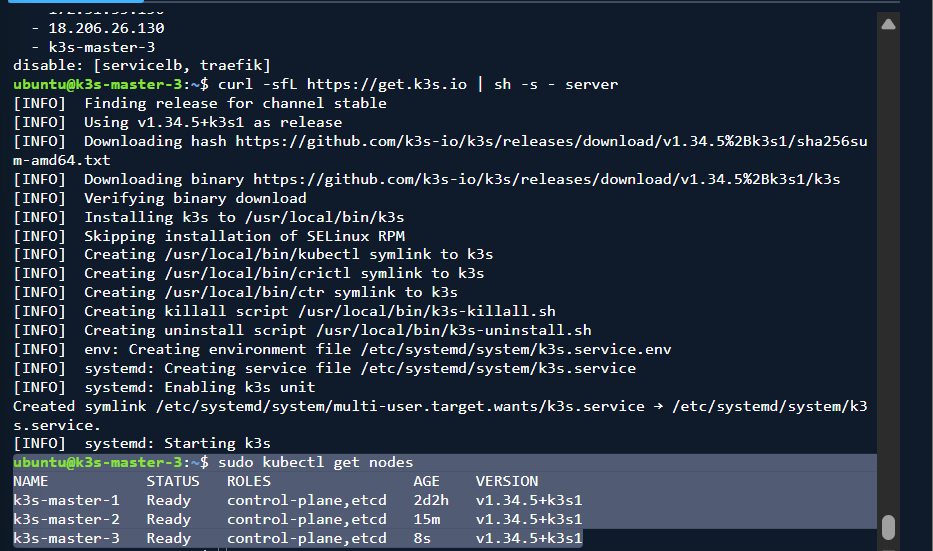
---

## Step 5: Configure kubectl Remotely (Optional)

```sh
# Copy the kubeconfig from k3s-master-1 to your local machine
mkdir -p ~/.kube
scp -i ~/k3s-master-1.pem ubuntu@98.88.155.180:~/k3s.yaml ~/.kube/k3s.yaml

# Update the server address to the public IP of a master node
sed -i 's|https://127.0.0.1:6443|https://98.88.155.180:6443|' ~/.kube/k3s.yaml


# Use this kubeconfig
export KUBECONFIG=~/.kube/k3s.yaml

kubectl get nodes
```

---

## Step 6: Deploy a Test Application

```sh
kubectl apply -f web-app.yml

# Verify pods and service
kubectl get pods,svc

# Access the app — use the public IP of any master node and the NodePort
curl http://98.88.155.180:30080
```

Expected output: `welcome to my web app!`


### Test Application Deployed
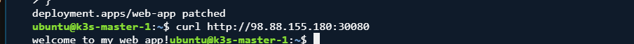
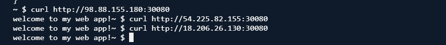
---

## Step 7: Configure NGINX Ingress Controller

K3s can deploy Helm charts automatically by placing a manifest in `/var/lib/rancher/k3s/server/manifests/`.

```sh
# On k3s-master-1
sudo cp nginx-ingress.yml /var/lib/rancher/k3s/server/manifests/nginx-ingress.yaml

# Verify the controller starts
sudo kubectl -n ingress-nginx get pods
```

The `LoadBalancer` service automatically provisions an AWS NLB. The NLB DNS name is shown in the `EXTERNAL-IP` column of `kubectl -n ingress-nginx get svc`.

The `nginx-ingress.yml` manifest in this repository already includes the NLB annotations:
```yaml
service.beta.kubernetes.io/aws-load-balancer-type: "nlb"
service.beta.kubernetes.io/aws-load-balancer-cross-zone-load-balancing-enabled: "true"
```

---

## Step 8: Configure Default Storage

K3s ships with **local-path-provisioner** out-of-the-box. It dynamically provisions `hostPath` volumes on the node where the pod is scheduled. Refer to the [local-path-provisioner docs](https://github.com/rancher/local-path-provisioner/blob/master/README.md#usage) for more configuration options.

### 8.1 — Change the default storage path (optional)

Add the following to `/etc/rancher/k3s/config.yaml` on all master nodes and restart K3s:

```yaml
default-local-storage-path: /mnt/disk1
```

```sh
sudo systemctl restart k3s

# Restart the provisioner to pick up the new path
kubectl -n kube-system rollout restart deploy local-path-provisioner
```

### 8.2 — Test local-path storage

```sh
kubectl create -f pvc.yaml
kubectl create -f pod.yaml

kubectl get pvc
kubectl get pv
kubectl get pod volume-test
```

### 8.3 — EBS CSI driver (production alternative)

For production workloads that need durable, network-attached block storage, install the [AWS EBS CSI driver](https://github.com/kubernetes-sigs/aws-ebs-csi-driver):

```sh
kubectl apply -k "github.com/kubernetes-sigs/aws-ebs-csi-driver/deploy/kubernetes/overlays/stable/?ref=release-1.35"
```

Create a StorageClass backed by EBS:

```yaml
apiVersion: storage.k8s.io/v1
kind: StorageClass
metadata:
  name: ebs-sc
provisioner: ebs.csi.aws.com
volumeBindingMode: WaitForFirstConsumer
parameters:
  type: gp3
```

---

## Step 9: (Optional) Adding Worker Nodes

To add a dedicated worker (agent) node, launch an additional EC2 instance (any type) in the same security group and run:

### 9.1 — Launch a Worker EC2 Instance

Launch a new EC2 instance from the AWS Console:
- **Name:** `k3s-worker-1`
- **AMI:** Ubuntu Server 22.04 LTS
- **Instance type:** `t3.large`
- **Key pair:** same key pair used for the master nodes
- **Security group:** Create a new security group with the following inbound rules:

| Type | Protocol | Port | Source |
|------|----------|------|--------|
| SSH | TCP | 22 | 0.0.0.0/0 |
| Custom TCP | TCP | 6443 | 0.0.0.0/0 |

## 9.2 — Allocate and Associate an Elastic IP

1. Go to **EC2 → Elastic IPs → Allocate Elastic IP address**
2. Select the new EIP → **Actions → Associate Elastic IP address**
3. Select `k3s-worker-1` and click **Associate**


```sh
# On the new worker node
sudo mkdir -p /etc/rancher/k3s
sudo tee /etc/rancher/k3s/config.yaml <<EOF
server: https://172.31.46.154:6443
token: <token-from-master-1>
node-ip: 172.31.89.63
EOF

curl -sfL https://get.k3s.io | sh -s - agent
```

Verify on a master node:

```sh
kubectl get nodes -o wide
```

---

## Step 10: Uninstalling K3s

```sh
# On server (master) nodes
/usr/local/bin/k3s-uninstall.sh

# On agent (worker) nodes
/usr/local/bin/k3s-agent-uninstall.sh
```

---

## Troubleshooting

### Check K3s service logs

```sh
journalctl -u k3s -f
```

### Check etcd health

```sh
sudo k3s etcd-snapshot list

# Detailed etcd member list
sudo k3s etcd-snapshot ls

# etcdctl (available inside the K3s binary)
sudo k3s kubectl -n kube-system exec -it \
  $(sudo k3s kubectl -n kube-system get pod -l component=etcd -o jsonpath='{.items[0].metadata.name}') \
  -- etcdctl --endpoints=https://127.0.0.1:2379 \
     --cacert=/var/lib/rancher/k3s/server/tls/etcd/server-ca.crt \
     --cert=/var/lib/rancher/k3s/server/tls/etcd/client.crt \
     --key=/var/lib/rancher/k3s/server/tls/etcd/client.key \
     member list
```

### Nodes stay in `NotReady`

- Check security group rules — ensure ports 8472/UDP (Flannel VXLAN) and 10250/TCP (Kubelet) are open between nodes.
- Verify all nodes can resolve each other's hostnames: `ping k3s-master-2` from k3s-master-1.

### API server unreachable from kubectl

- Ensure port 6443/TCP is open in the security group for your local IP.
- Verify the `server:` URL in your local kubeconfig points to the correct public IP.

### Instance Metadata Service (IMDS)

K3s uses IMDSv2 on EC2 for the node's ProviderID. If you see errors related to instance metadata, ensure IMDSv2 is enabled and the hop limit is at least 2:

```sh
aws ec2 modify-instance-metadata-options \
  --instance-id <instance-id> \
  --http-put-response-hop-limit 2 \
  --http-endpoint enabled \
  --region $AWS_REGION
```

### Private Registry (Amazon ECR)

See `registries.yml` for the ECR configuration. The recommended approach on EC2 is to attach the `AmazonEC2ContainerRegistryReadOnly` IAM policy to the instance profile — no static credentials are needed.


## Evidence

## All 3 Nodes Ready


## All Pods Running
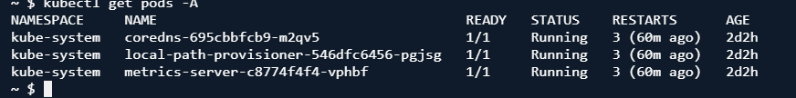

## EC2 Instances on AWS Console
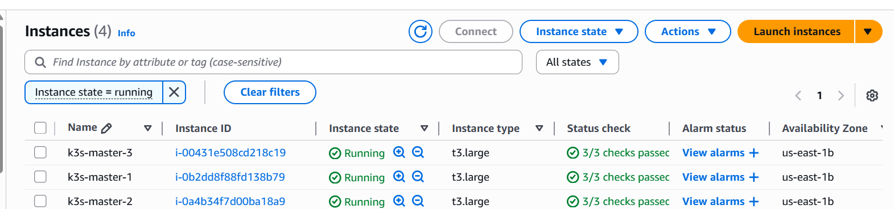

## Test Application Deployed
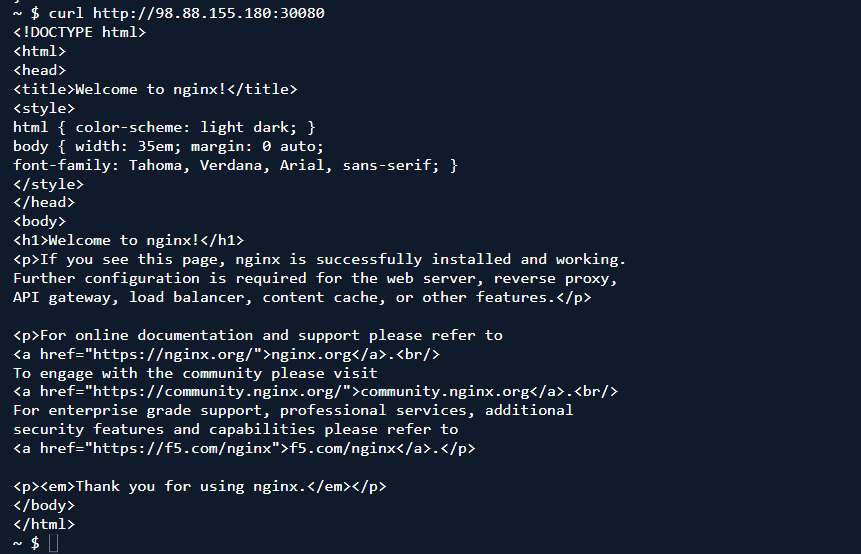


## Storage — PVC Bound and Pod Running
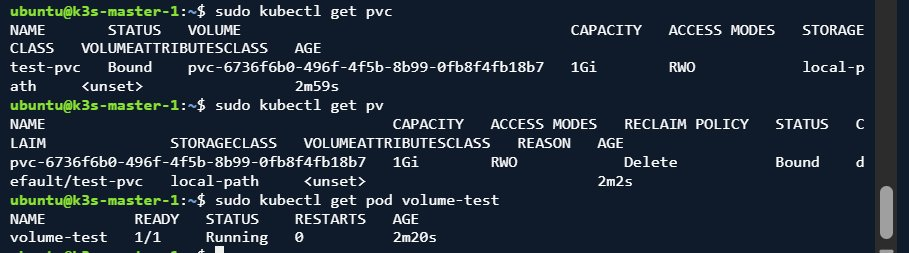
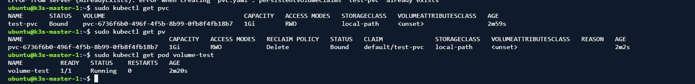

## Worker Node — K3s Agent Installing
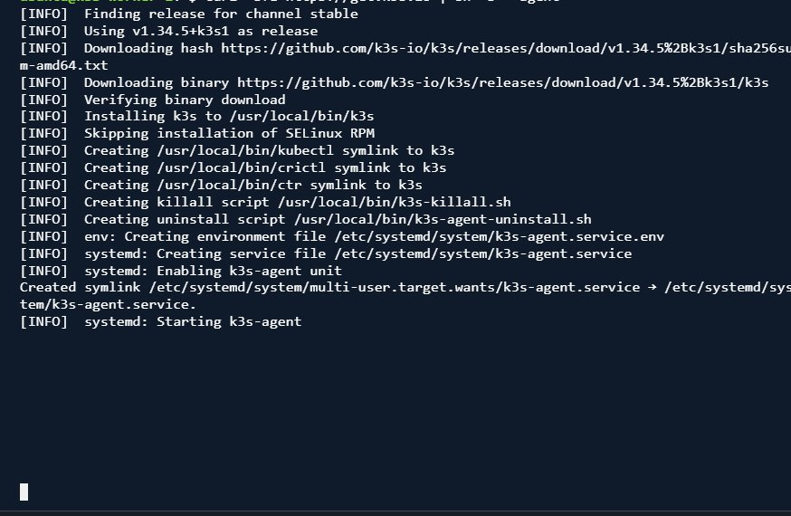

## Worker Node — Agent Active and Running
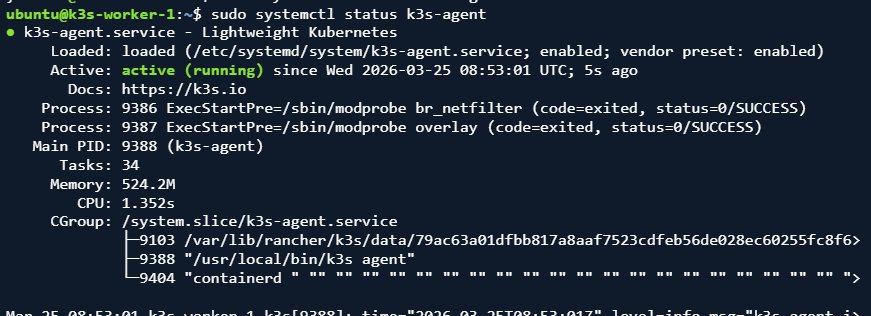


## Troubleshooting — etcd Logs During Node Failure
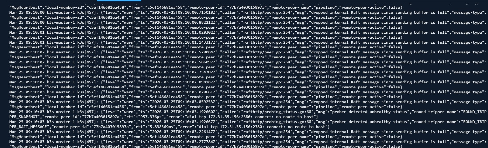

## Troubleshooting — etcd Snapshot List
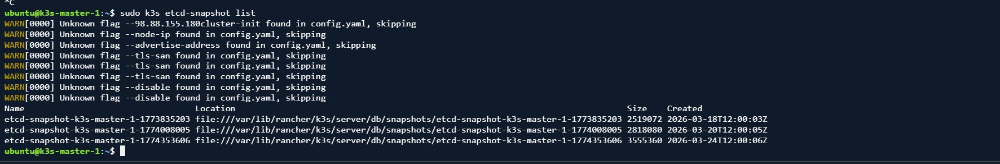

## Troubleshooting — Ping Tests and Node Recovery
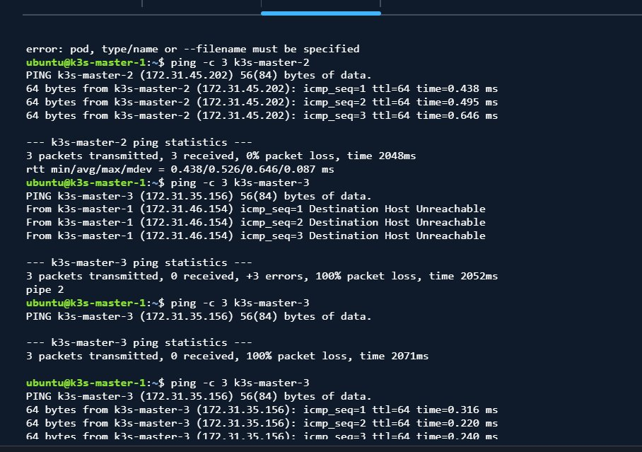

## Step 10 — K3s Uninstall on Worker Node
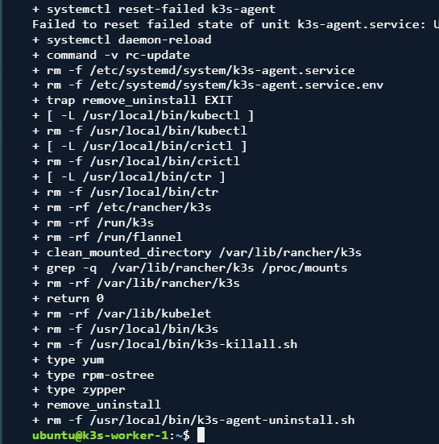


## Reflection
Getting hands-on with K3s on AWS shed a different light on me about Kubernetes. I now understand what a control plane does. The API server receives every command, etcd stores the cluster state, and the scheduler decides where workloads run. Seeing this operate across three EC2 instances made the concepts click in a way that reading about them never could. I also learned how much networking matters. I initially thought launching servers and installing software would be simple, but getting three machines to trust and communicate required careful configuration of ports, protocols, and security rules.

The deployment did not go smoothly at first, which was the most valuable part. My first challenge was launching all three EC2 instances manually instead of using the CLI. Each got its own security group, which blocked communication. I resolved this by adding cross-security-group rules using the AWS CLI. Another issue was stale TLS certificates on master-2 and master-3 from previous installations. K3s refused to start until I deleted the certificate directories and reinstalled. Public IP addresses changing after a restart was another problem, fixed by allocating Elastic IPs for each master.

Testing the high-availability cluster was the most rewarding. Stopping one master node showed that the cluster kept running and all pods remained active. This made the value of HA clear. In real networks like 5G, critical functions must remain available even if infrastructure fails. Seeing the cluster maintain least made HA tangible.

This project also connected theoretical concepts like virtualization and containerization to real practice. Containers allow workloads to be packaged and deployed consistently, while Kubernetes orchestrates them across multiple nodes. This hands-on experience deepened my understanding of cloud-native systems and showed how infrastructure, software, and networking work together. Overall, the assignment was challenging but rewarding, giving me practical skills I can apply in future cloud and networking projects.

## K3s and 5G Cloud Native Concepts
5G networks are no longer built on dedicated hardware they run as software on cloud infrastructure. Network functions like the AMF, SMF, and UPF are containerised microservices that need to be orchestrated, scaled, and recovered automatically. K3s brings this capability to edge locations and resource constrained nodes, making it a strong fit for Multi Access Edge Computing deployments.
The high availability setup in this assignment three control plane nodes backed by embedded etcd mirrors what production 5G deployments require for carrier grade resilience.

## Virtualisation and Containerisation for Scalable Services
Virtualisation gave us the ability to run multiple isolated environments on one physical machine. Containerisation made those environments even lighter and faster to spin up. Kubernetes ties it all together by automating how containers are deployed, scaled, and recovered across a cluster.
In this assignment, deploying three nginx replicas showed this in action Kubernetes spread the pods across nodes automatically, and the workload would continue running if one node failed.
This assignment gave me more than Kubernetes knowledge. It taught me how to debug real infrastructure problems, read logs, trace connectivity issues, and iterate until things work.
